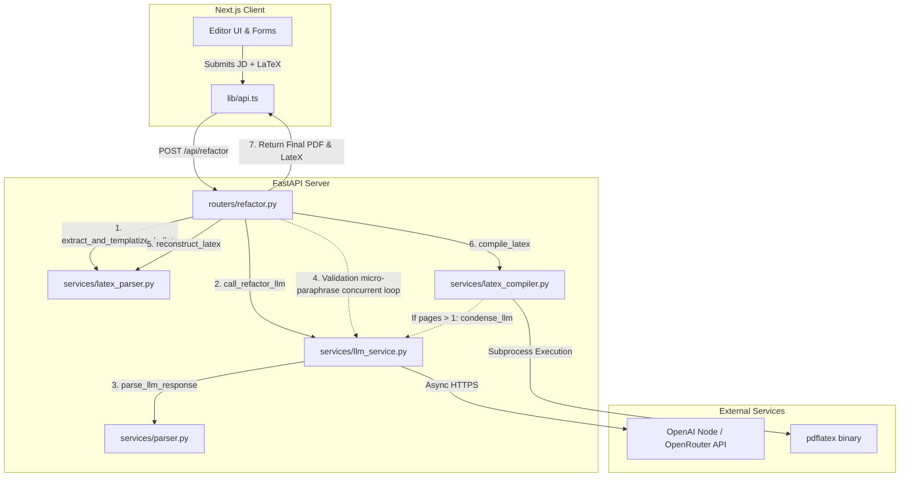

# ATS Engine Architecture & System Design

This document offers a full architectural breakdown of the ATS Refactoring Engine. It was generated to provide a comprehensive mental model for debugging, feature development, or architectural adjustments (such as adding new LLMs).

## System Overview

The ATS Engine operates as a pipeline to refactor an existing LaTeX resume entirely dynamically against a target Job Description. Instead of using a standard conversational AI flow, it leverages heavily structured data-mapping and concurrent micro-paraphrasing loops to ensure the final resume remains exactly **one page** while aggressively inserting keywords formatting for Applicant Tracking Systems (ATS).

## High-Level Architecture Diagram

---

## File Interactions and Data Flow

### 1. Reception (`frontend/src/lib/api.ts` -> `app/routers/refactor.py`)
- The Next.js frontend sends a `RefactorRequest` JSON containing `job_description` and `latex_code`.
- `refactor_resume` (in `routers/refactor.py`) is the primary orchestration controller managing the asynchronous lifecycle of the request.

### 2. LaTeX Decomposition (`app/services/latex_parser.py`)
- **Action**: The backend doesn't feed the entire LaTeX string into the LLM as unstructured text (which would lead to severe syntax hallucination). Instead, it calls `extract_and_templatize_bullets()`.
- **Logic**: RegEx captures exact `\item` nodes scattered within the "Professional Experience" and "Projects" sectors of the LaTeX. It extracts them into a Python dictionary (`bullets_map`) mapped to UUID-like keys. The raw LaTeX string is replaced with structural placeholders.

### 3. Primary LLM Generation (`app/services/llm_service.py`)
- **Action**: The `call_refactor_llm` function is invoked.
- **Payload**: The system prompt (`app/prompts/system_prompt.py`), the Job Description, the contextual full LaTeX, and uniquely, the JSON key-value store of targets (`bullets_map`).
- **Provider**: Handled via `_call_chat` using the standard `AsyncOpenAI` client initialized with `LLM_BASE_URL` (typically OpenRouter or OpenAI).

### 4. Response Parsing (`app/services/parser.py`)
- **Action**: Extracts the LLM chain-of-thought and strictly enforces valid JSON deserialization to extract exactly what the LLM wrote back as the new bullet strings (`parse_llm_response`).

### 5. Validation & Layout Protection Loop (`app/routers/refactor.py`)
- **Action**: The system utilizes an incredibly strict concurrency pattern (via `asyncio.gather`).
- **Logic**: For every modified bullet returned by the LLM, the backend measures the length. If the **new bullet** is longer than the **original bullet**, the layout is at risk of overflowing onto a second page. It will inherently invoke `call_paraphrase_bullet_llm` up to 3 times to squish the bullet point dynamically, ensuring it maintains the exact character threshold size of the original string.

### 6. Sanitization and Reassembly
- Replaces hallucinatory backslash anomalies using multi-stage regex.
- Passes the cleaned strings back into `reconstruct_latex` (`latex_parser.py`) which injects the new ATS-ready text directly back into the structurally identical LaTeX templates.

### 7. Compilation (`app/services/latex_compiler.py`)
- The backend writes the final string to a temporary directory and executes `pdflatex`.
- Reads the generated `.pdf` to byte format and converts it to a base64 encoded string.
- Reads `pdflatex`'s log to ascertain the actual physical page count computed by the TeX engine.

### 8. Emergency Condensation Pass
- If the layout engine evaluates the final document length strictly > 1 page, the orchestrator routes the whole document into `call_condense_llm` (`llm_service.py`).
- This pass asks the LLM to prune filler text across the entire layout before attempting to recursively compile again. 

### Final Handshake
The `.pdf` file (in base64), the `refactored_latex` code, and the algorithmic recruiter's `thought_process` are zipped into a `RefactorResponse` JSON struct and shipped back over HTTP. The Next.js frontend maps the base64 string directly into an `<iframe src="data:application/pdf;base64,{pdf_base64}">`, delivering an instantaneous visual update without utilizing physical blob storage.

---

## Configuration State (Post-Cleanup)
The environment handles provider mapping trivially:
- The system connects with any OpenAI-Schema compatible API.
- `LLM_PROVIDER` governs which schema variant is actively executing.
- `LLM_BASE_URL` points the system off the standard OpenAI domain to endpoints like Groq, SiliconFlow, or OpenRouter.

## Developer Strategy Note: 
To plug in a brand-new LLM strategy, one only needs to either tweak the credentials in `.env`, adjust the `system_prompt.py` constraints, or alter how `_call_chat` serializes payloads in `llm_service.py`. The fundamental routing tree will not need modification.
